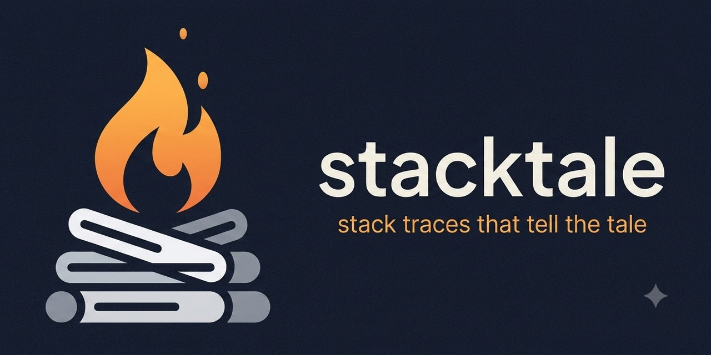

<p align="center">
  
</p>

<p align="center">
  <a href="https://github.com/stacktale/stacktale/actions/workflows/ci.yml"></a>
  <a href="https://central.sonatype.com/artifact/io.github.gabrielbbaldez/stacktale"></a>
  
  
</p>

# stacktale

> *Stack traces that tell the tale.*

A Logback appender that turns Java errors into **AI-ready reports**. Add one dependency —
and every error your app logs becomes a complete, token-efficient report in
`errors-ai.log`, shaped for a reader that increasingly triages your errors: an AI
assistant or an automated agent. It's written **alongside** your normal logs — the full
stack trace stays exactly where it is.

<p align="center">
  
  <br>
  <sub><b>Stack trace → stacktale report → paste to your AI → fixed.</b> One paste, no interrogation. <a href="https://stacktale.github.io/stacktale/">See it live →</a></sub>
</p>

## Why

The Java error log format was designed in the 90s for a human with `grep`, and for that
reader it works — you learn where to look, what to skip, and when the framework frame you'd
ignore is actually the clue. But an AI assistant reads an error with none of that muscle
memory: every one of those 60 lines is context and token cost, and the information it needs
most is scattered across the log or never recorded at all:

- **What happened before the error.** The log lines that explain the failure exist, but
  they're interleaved with 20 other threads, hundreds of lines above the stack trace.
- **The values involved.** `NullPointerException at OrderService.java:87` forces the AI
  to guess. The message args, the MDC, the state inside the exception — all captured at
  log time, all scattered or dropped.
- **The environment.** App version, git commit, Java version, profile: an AI asks for
  these in half of all debugging sessions, because no log line carries them.

So every pasted-log debugging session becomes an interrogation: 5–10 messages of the AI
asking for context that existed at the moment of the error and was thrown away.
stacktale captures that context **at the source** and writes it as one structured block.
Post-processing can't do this — by the time the log is written, the story is gone.

And it **distills rather than discards**: your culprit frame and the full `wrapped by:`
chain (where a proxy or reflection clue usually hides) stay; only repetitive framework runs
collapse into a labeled count like `… 30 collapsed (spring ×20, tomcat ×10)`. When you want
all 60 lines, they're still in your normal log, untouched.

## What the AI sees

A real report produced by [`DemoApp`](stacktale/src/test/java/io/github/gabrielbbaldez/stacktale/DemoApp.java)
— an order flow where a cache miss returns `null`, nobody checks it, and the NPE gets
wrapped in a domain exception:

```
━━━ ERROR #c73cf755 ━━━ 2026-07-09 20:46:02.315 thread=main ━━━
NullPointerException: Cannot invoke "DemoApp$Customer.email()" because "customer" is null
at DemoApp.confirmOrder(DemoApp.java:73) ← YOUR CODE
wrapped by: OrderConfirmationException("confirmation aborted for order 123") at DemoApp.confirmOrder(DemoApp.java:76)
log: "Failed to confirm order {}" args=[123] logger=i.g.g.s.d.OrderService
mdc: traceId=9f3a userId=42
fields: failedStep=send-confirmation-email orderId=123 retryable=false

story (traceId=9f3a, last 4 events, 433ms):
  20:46:01.882 INFO  OrderController  POST /orders/123/confirm
  20:46:02.001 INFO  CustomerClient   fetching customer 555 → HTTP 404
  20:46:02.001 WARN  CustomerCache    miss for customer 555, returning null
  20:46:02.315 ERROR OrderService     Failed to confirm order 123   ← this error

stack (distilled, 2 of 2 frames):
  DemoApp.confirmOrder(DemoApp.java:73) ← culprit
  DemoApp.main(DemoApp.java:61)

env: app=shop-api 1.4.2 (git 7e3c1f) | java 21.0.6 | windows
━━━ END #c73cf755 ━━━
```

Read the `story`: the root cause — the cache returning `null` on a 404 — is right there,
one line above the error. The `fields:` line is the state the domain exception carried.
In a traditional log, the story lines were 300 lines up, tangled with other threads, and
the exception's state didn't exist at all. An AI (or you) reads this block once and knows
what happened, with which values, in which environment.

Your console meanwhile shows a single extra line:

```
INFO stacktale -- AI error report #c73cf755 → ./errors-ai.log
```

## Quickstart

All artifacts are on Maven Central.

### Spring Boot (zero config)

```xml
<dependency>
  <groupId>io.github.gabrielbbaldez</groupId>
  <artifactId>stacktale-spring-boot-starter</artifactId>
  <version>0.4.0</version>
</dependency>
```

**Gradle (Groovy)**

```groovy
implementation 'io.github.gabrielbbaldez:stacktale-spring-boot-starter:0.4.0'
```

**Gradle (Kotlin DSL)**

```kotlin
implementation("io.github.gabrielbbaldez:stacktale-spring-boot-starter:0.4.0")
```

That's it — no logback.xml editing. The starter registers the appender on the root
logger, deduces `← YOUR CODE` packages from your `@SpringBootApplication`, and adds a
servlet filter that opens every story with the HTTP request line (`GET /orders/889/checkout`)
through a stacktale-only logger — **your console never sees those lines**. Tune anything
via `stacktale.*` properties in `application.yml`.

### Plain Logback (any framework, or none)

```xml
<dependency>
  <groupId>io.github.gabrielbbaldez</groupId>
  <artifactId>stacktale</artifactId>
  <version>0.4.0</version>
</dependency>
```

**Gradle (Groovy)**

```groovy
implementation 'io.github.gabrielbbaldez:stacktale:0.4.0'
```

**Gradle (Kotlin DSL)**

```kotlin
implementation("io.github.gabrielbbaldez:stacktale:0.4.0")
```

```xml
<appender name="STACKTALE" class="io.github.gabrielbbaldez.stacktale.logback.StacktaleAppender">
  <appPackages>com.your.app</appPackages> <!-- optional but recommended -->
</appender>

<root level="INFO">
  <appender-ref ref="CONSOLE"/>
  <appender-ref ref="STACKTALE"/>
</root>
```

Reports land in `./errors-ai.log`. Point your AI assistant at that file — it announces
itself on startup, and the file header explains the format to any AI that opens it.

### Log4j2

```xml
<dependency>
  <groupId>io.github.gabrielbbaldez</groupId>
  <artifactId>stacktale-log4j2</artifactId>
  <version>0.4.0</version>
</dependency>
```

**Gradle (Groovy)**

```groovy
implementation 'io.github.gabrielbbaldez:stacktale-log4j2:0.4.0'
```

**Gradle (Kotlin DSL)**

```kotlin
implementation("io.github.gabrielbbaldez:stacktale-log4j2:0.4.0")
```

```xml
<Configuration packages="io.github.gabrielbbaldez.stacktale.log4j2">
  <Appenders>
    <Stacktale name="STACKTALE" appPackages="com.your.app"/>
  </Appenders>
  <Loggers>
    <Root level="info"><AppenderRef ref="STACKTALE"/></Root>
  </Loggers>
</Configuration>
```

Same pipeline, same st/1 format, story correlation via `ThreadContext` — both backends
share `stacktale-core`.

### java.util.logging (JUL) / System.Logger

For apps that log through the JDK's own logging — or `System.Logger`, which routes to JUL
by default — with no SLF4J bridge:

```xml
<dependency>
  <groupId>io.github.gabrielbbaldez</groupId>
  <artifactId>stacktale-jul</artifactId>
  <version>0.5.0</version>
</dependency>
```

**Gradle (Groovy)**

```groovy
implementation 'io.github.gabrielbbaldez:stacktale-jul:0.5.0'
```

**Gradle (Kotlin DSL)**

```kotlin
implementation("io.github.gabrielbbaldez:stacktale-jul:0.5.0")
```

```properties
# logging.properties
handlers = io.github.gabrielbbaldez.stacktale.jul.StacktaleJulHandler

# All keys use the handler's fully-qualified class name as prefix.
# Only the properties below are read; anything else is ignored.
io.github.gabrielbbaldez.stacktale.jul.StacktaleJulHandler.file = errors-ai.log
io.github.gabrielbbaldez.stacktale.jul.StacktaleJulHandler.appPackages = com.your.app
io.github.gabrielbbaldez.stacktale.jul.StacktaleJulHandler.format = text
io.github.gabrielbbaldez.stacktale.jul.StacktaleJulHandler.storySize = 15
io.github.gabrielbbaldez.stacktale.jul.StacktaleJulHandler.storyWindowSeconds = 60
io.github.gabrielbbaldez.stacktale.jul.StacktaleJulHandler.dedupWindowSeconds = 300
io.github.gabrielbbaldez.stacktale.jul.StacktaleJulHandler.maxFileSizeMb = 5
io.github.gabrielbbaldez.stacktale.jul.StacktaleJulHandler.maxBackups = 1
io.github.gabrielbbaldez.stacktale.jul.StacktaleJulHandler.maxReportsPerMinute = 0
io.github.gabrielbbaldez.stacktale.jul.StacktaleJulHandler.redactionEnabled = true
io.github.gabrielbbaldez.stacktale.jul.StacktaleJulHandler.redactionCorrelation = false
io.github.gabrielbbaldez.stacktale.jul.StacktaleJulHandler.redactPatterns = (password|token)=.*;;secret=\w+
```

`SEVERE` records become reports; lower levels feed the story (which correlates by thread,
since JUL has no MDC). No extra dependency — JUL is in the JDK.

## Ecosystem

One `stacktale-core`, every entry point — add only the ones your stack uses:

| Where your app logs | Module |
|---|---|
| **Logback** | `stacktale` — the appender ([quickstart](#plain-logback-any-framework-or-none)) |
| **Log4j2** | `stacktale-log4j2` |
| **java.util.logging / `System.Logger`** | `stacktale-jul` |
| **Spring Boot** | `stacktale-spring-boot-starter` — zero-config, auto-registered |

| Where the report is consumed | |
|---|---|
| **AI assistants (MCP)** | `stacktale-mcp` — read reports as tools in Claude Code / Cursor |
| **Throw-site arguments** | `stacktale-agent` — an optional `-javaagent` capturing method args |
| **IntelliJ IDEA / JetBrains** | [**stacktale-intellij**](https://github.com/stacktale/stacktale-intellij) — a tool window over `errors-ai.log`: reports newest-first, double-click to jump to the culprit line, copy-for-AI |

Every library module is Java 17+, [JPMS](#java-modules-jpms)-ready and [GraalVM-native](docs/native.md)-ready.
On the roadmap: idiomatic starters for **Micronaut** (#81) and **Quarkus** (#82) — both already usable today through the Logback / JUL adapters — plus a **VS Code extension** (#70) and a **`stacktale` CLI** (#71).

## What gets captured

| Section | What it is |
|---|---|
| headline | The **root cause**, first — wrappers become one `wrapped by:` line each |
| `at` | The culprit frame: first frame of *your* code in the root cause |
| `log` | The message pattern, its args (the values!), and the logger |
| `mdc` | The full MDC at the moment of the error |
| `fields` | **State carried by the exception chain itself** — `orderId`, `statusCode`, `retryable` — read from public getters/fields with hard safety caps |
| `captured` | *(with `stacktale-agent`)* **Method arguments at the throw site** — `confirmOrder(orderId=889, customer=null)` — even when the code logged nothing |
| `story` | The last events from the same request (MDC `traceId`) or thread — the narrative that led to the error |
| `stack` | Distilled: framework runs collapse into `… 39 collapsed (spring ×24, tomcat ×11)` |
| `env` | App name/version, git sha, Java version, profile, OS — collected once |
| repeats | The same error again doesn't dump again: `━ #c73cf755 repeated 47× ━` |
| restarts | `─── app start … ───` markers separate application runs |

Everything user-controlled is **redacted by default** (JWTs, bearer tokens,
`password=...` pairs, long hex secrets, emails, Luhn-valid card numbers) and flattened to
one line per section. Uncaught exceptions (threads dying without any `log.error`) flow
through the same pipeline.

## Performance (measured, JMH)

| Path | Cost |
|---|---|
| Logback INFO, no appenders (baseline) | 27 ns/op |
| Logback INFO **with stacktale** (story capture) | **137 ns/op** |
| Repeated ERROR, deduplicated (no report written) | 3.9 µs/op |

~110 ns per happy-path event on an ordinary dev machine (JDK 21, Windows, single JMH
fork — reproduce with [`AppendBenchmark`](stacktale/src/test/java/io/github/gabrielbbaldez/stacktale/AppendBenchmark.java)).
Writing a full report costs milliseconds — errors are rare, that's the deal.

## Token economics (measured)

Counted with a real tokenizer (`cl100k`) on the artifacts of an actual dogfooding
session — a Spring Boot shop hit over HTTP until 7 distinct failures occurred:

| What the AI reads | Tokens | Savings |
|---|---|---|
| Classic console log of the session (10 943 lines) | 223 370 | — |
| `errors-ai.log` for the same session, all reports | 3 696 | **98.3% (60× less)** |
| Classic stack-trace block for ONE error | 2 119 | — |
| The st/1 block for the same error | 411 | **80.6% less — carrying MORE info** (story, fields, env) |

The classic log grows with traffic; the report file grows only with distinct errors.

## Query reports as AI tools (MCP)

`stacktale-mcp` is a tiny read-only [MCP](https://modelcontextprotocol.io) server: your
AI assistant queries reports as tools instead of reading files — across rotations,
sessions and paths.

```json
{ "mcpServers": { "stacktale": {
    "command": "java",
    "args": ["-jar", "stacktale-mcp.jar", "--file", "/path/to/errors-ai.log"]
} } }
```

Tools: `list_errors` (id, time, headline, repeat count — newest first), `get_report`
(the full st/1 block), `errors_since` (blocks after a timestamp). No network, no writes.
Full per-client setup (Claude Code, Claude Desktop, Cursor) in
[docs/mcp-setup.md](docs/mcp-setup.md).

Shipping to aggregators instead? Set `emitReportsToLogger=true` and each report block is
also emitted as ONE log event through logger `stacktale.reports` — attach your existing
Loki/ELK/CloudWatch shipper to that logger and production reports reach your incident
tooling with zero stacktale-specific infrastructure.

## Capture what nobody logged (the agent)

The optional `stacktale-agent` instruments your packages and, when an exception escapes
a method, records that method's **argument values** into the report:

```
java -javaagent:stacktale-agent.jar=packages=com.your.app -jar app.jar
```

```
captured (method args at throw site, via stacktale-agent):
  OrderService.sendConfirmation(orderId=889, customer=null, tier=EXPRESS)
  OrderService.confirm(orderId=889, customer=null, express=true)
```

The `customer=null` nobody logged is right there. Zero happy-path overhead (the advice
only runs on the exceptional exit), bounded captures (5 frames, 60 chars per value),
values pass through redaction, and real parameter names appear when the app is compiled
with `-parameters` (`argN` otherwise). Scope note: arguments, not full local variables —
that trade-off is what keeps it safe and free.

**Alongside another agent (OpenTelemetry, Datadog).** Production JVMs usually already run
a vendor agent, and stacktale-agent coexists with one — a CI test
(`AgentCoexistenceIT`) runs it behind the OpenTelemetry javaagent and confirms both load
and stacktale still captures. **Order it last** so it layers onto the (already
instrumented) classes: `-javaagent:otel.jar -javaagent:stacktale-agent.jar=...`. The
capture advice fires only on the exceptional path, so the added cost lands on throws, not
the happy path — measured at ≈2µs per throw with both agents attached.

## Reactive (WebFlux)

The starter detects reactive apps: a `WebFilter` opens each story with the request line
and plants the `traceId` in the Reactor Context, and stacktale enables automatic context
propagation (micrometer `context-propagation`) so the story survives `flatMap`s and
scheduler hops — validated by a test that crosses `boundedElastic` and `parallel` before
failing.

## Does it actually help? (blind A/B)

We ran a blind test: [`BlindTestScenario`](stacktale/src/test/java/io/github/gabrielbbaldez/stacktale/BlindTestScenario.java)
simulates a checkout that dies on a total-limit sanity check while 6 other request
threads produce realistic traffic. The true root cause (a stale-price fallback mixing
USD prices into a BRL order) never appears in the stack trace — only in the events
before the error. The SAME run wrote both a classic interleaved log (95 lines) and a
stacktale report (27 lines). Two fresh AI agents, identical prompts, no source access,
each got one artifact.

Honest results: **both found the root cause** (95 lines still fit a strong model's
attention) — but the report needed **~4× less input**, zero effort separating 7 threads
of noise, and its reader inferred blast radius from the format itself (no `repeated N×`
lines → single occurrence). The structural argument stands: classic logs grow with
traffic; a stacktale report stays ~27 lines per error, story attached.

## Configuration

Everything is optional — as appender properties in `logback.xml`, or `stacktale.*` in
`application.yml` with the starter:

| Property | Default | What it does |
|---|---|---|
| `file` | `errors-ai.log` | Where reports go |
| `appPackages` | *(heuristic / auto in Spring)* | Comma-separated roots marked `← YOUR CODE` |
| `storySize` | `15` | Events kept per context for the story |
| `storyWindowSeconds` | `60` | Max age of story events |
| `dedupWindowSeconds` | `300` | One full report per error per window |
| `maxFileSizeMb` | `5` | Size-based rotation threshold |
| `maxBackups` | `1` | Rotated backups kept (0 = start fresh) |
| `truncateOnStart` | `false` | Drop the previous session's reports on startup |
| `installUncaughtHandler` | `true` | Report uncaught exceptions too |
| `reportErrorsWithoutThrowable` | `true` | `log.error(...)` without exception still reports |
| `captureExceptionFields` | `true` | Read exception getters into `fields:` |
| `redactionEnabled` | `true` | Mask secrets/PII in report content |
| `redactPattern` / `redactPatterns` | — | Extra redaction regexes (see note below) |
| `redactionCorrelation` | `false` | Tag masked values with a stable keyed token (`███(a1b2)`) so an AI can see the same secret recurring |
| `correlationMdcKeys` | `traceId,correlationId,requestId` | MDC keys that group the story |
| `zone` | system | Timezone for report timestamps |
| `echoSuppressionMillis` | `2000` | Skip container re-logs of a failure this thread just reported (0 = off) |
| `containerLogger` / `containerLoggers` | Tomcat's | Extra logger prefixes treated as container echoes (see note below) |
| `emitReportsToLogger` | `false` | Also emit each block as ONE event via logger `stacktale.reports` |
| `maxReportsPerMinute` | `0` (unlimited) | Cap full reports/min; a cascade of distinct errors becomes a `storm:` line instead of flooding the file |
| `format` | `text` | `text` (densest for an LLM to read) or `json` ([st-json/1](docs/FORMAT.md) NDJSON, for parsers/pipelines) |
| `stacktale.enabled` *(starter)* | `true` | Set to `false` to disable the appender, request filter, and reactive config entirely |
| `requestLogging` *(starter)* | `true` | HTTP request lines into the story |

**Redaction patterns by framework.** Logback: repeatable `<redactPattern>` elements in
`logback.xml`. Log4j2/JUL: a single string with patterns separated by `;;` (regexes may
contain commas, so commas are not the delimiter).

**Container loggers by framework.** Logback: repeatable `<containerLogger>` elements.
Log4j2: a comma-separated `containerLoggers` attribute. JUL: uses the built-in default
(`org.apache.catalina.core.ContainerBase`) and does not currently support custom values.

The **agent** takes `-javaagent:stacktale-agent.jar=packages=com.your.app` plus optional
`excludes=`, `maxFrames=`, `maxValueLength=`, and `renderToString=false` (privacy mode:
record an object's type and nullness, never its `toString()`). The **MCP server**
supports resource subscriptions — your AI assistant is notified the moment a new error
lands, instead of polling.

Async work: wrap hops with [`StacktaleExecutors`](stacktale/src/main/java/io/github/gabrielbbaldez/stacktale/StacktaleExecutors.java)
(`wrap(executor)` / `wrap(runnable)`) so the MDC — and with it the story — survives
`CompletableFuture`, pools and virtual threads. Apps already propagating context
(Micrometer, Reactor) need nothing.

## Guarantees

- **Never breaks your app.** Any internal failure degrades stacktale to a no-op —
  including invalid configuration at startup (a broken `<file>` can't fail your boot).
- **Cheap happy path.** ~110 ns per non-error event, measured. No I/O off the error path.
- **The format is a public API.** `st/1` is pinned by golden-file tests and the file
  header teaches it to any AI. Format changes are deliberate and versioned.
- **Nothing leaves the machine.** A local file, same trust boundary as your logs. No
  network, no phone-home. Redaction on by default anyway.

## Limitations (honest ones)

- The story follows MDC correlation keys, falling back to same-thread. Fully async apps
  **without MDC propagation** get a fragmented story — use `StacktaleExecutors` or any
  context-propagation library.
- stacktale organizes what your app already logs. If the app logs nothing before the
  error, there is no story to tell.
- Redaction is regex-level hygiene, not semantic PII detection.
- `StacktaleExecutors` propagates the SLF4J MDC; in Log4j2-native apps (no SLF4J
  binding), propagate `ThreadContext` across hops yourself.

## Compatibility

Tested in CI against a version matrix (weekly + on any POM change). Supported floors,
each backed by a passing build:

| Dependency | Supported | Tested up to |
|---|---|---|
| Java | 17+ | 21 |
| Logback | 1.4+ | 1.5.x |
| Log4j2 | 2.20+ | 2.24.x |
| Spring Boot *(starter)* | 3.2+ | 3.5.x |

The Spring Boot starter follows Boot's own Logback version (1.5 on Boot 3.4+); the
`stacktale` and `stacktale-log4j2` artifacts work down to Logback 1.4 on their own.

### Java modules (JPMS)

Every jar declares a stable `Automatic-Module-Name`, so stacktale works on the module
path as well as the classpath — a resolution smoke test in CI pins this:

| Artifact | Module name |
|---|---|
| `stacktale-core` | `io.github.gabrielbbaldez.stacktale` |
| `stacktale` (Logback) | `io.github.gabrielbbaldez.stacktale.logback` |
| `stacktale-log4j2` | `io.github.gabrielbbaldez.stacktale.log4j2` |
| `stacktale-jul` | `io.github.gabrielbbaldez.stacktale.jul` |
| `stacktale-spring-boot-starter` | `io.github.gabrielbbaldez.stacktale.spring` |
| `stacktale-mcp` | `io.github.gabrielbbaldez.stacktale.mcp` |
| `stacktale-agent` | `io.github.gabrielbbaldez.stacktale.agent` |

> **Migrating to 0.5.0:** the Logback appender moved from
> `io.github.gabrielbbaldez.stacktale.StacktaleAppender` to
> `io.github.gabrielbbaldez.stacktale.logback.StacktaleAppender` (it used to share a
> package with the core, a split package that JPMS forbids). Update the `class="…"` in
> your `logback.xml` — a one-line change. The Spring Boot starter and Log4j2 configs are
> unaffected.

### GraalVM native-image

The report pipeline is reflection-free, so stacktale works in native (incl. Spring Boot 3
AOT) out of the box. `env:` is handled for you (bundled resource metadata + a Spring
`RuntimeHintsRegistrar`). The one section that needs your input is `fields:`, which
reflects over *your* exception types — register them and it keeps working; leave them and
it degrades to empty (never a crash). Full details and the escape hatch:
[docs/native.md](docs/native.md).

## Roadmap

The original roadmap (Central, Log4j2, starter, agent, MCP, real-world validation) has
shipped. What's next lives in the milestones:

- **[0.4.0](https://github.com/stacktale/stacktale/milestone/1)** — production
  hardening and the agentic loop: formal `st/1` spec, error-storm rate limiting, MCP
  push notifications, agent filters, compatibility matrix, one-click releases.
- **[1.0.0](https://github.com/stacktale/stacktale/milestone/2)** — maturity:
  frozen format spec, mutation-tested, soak-tested, SBOM + provenance, receiver-state
  capture exploration.

Contributions welcome — several issues are labeled `good first issue`. See
[CONTRIBUTING.md](CONTRIBUTING.md).

## License

[Apache-2.0](LICENSE)
